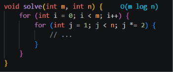
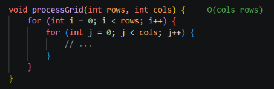
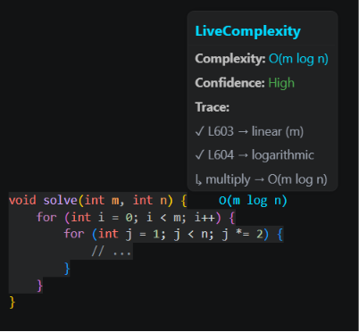
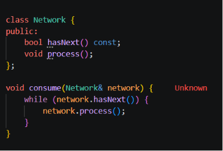

Deterministic AST-based real-time Big-O time complexity analysis for C++.

**Proven, Not Guessed.**

## Quick Links

- 📦 VS Code Marketplace: https://marketplace.visualstudio.com/items?itemName=livecomplexity.livecomplexity
- 💻 Install via CLI: `code --install-extension livecomplexity.livecomplexity`
- 🐙 GitHub: https://github.com/Eye-of-God-cyber/livecomplexity-vscode
- 🐞 Issues: https://github.com/Eye-of-God-cyber/livecomplexity-vscode/issues

## Current Scope

LiveComplexity currently focuses on deterministic **time complexity analysis for C++**.

Version 1 intentionally prioritizes correctness, structural proof, and low-latency editor feedback over broad language coverage or heuristic inference.

Space complexity analysis (Version 2) and additional language support are planned for future releases.

LiveComplexity derives Big-O time complexity directly from the abstract syntax tree (AST) of your code using deterministic structural analysis—not heuristics, probabilistic inference, or AI-generated guesses.

## Visuals



> Inline complexity annotation.



> Symbolic bound preservation.



> Hover trace of structural derivation.

## Features

- Deterministic AST-based analysis
- Real-time inline `O(...)` annotations
- Hover explanations with structural derivation
- Symbolic bound preservation
- Unknown instead of unsound inference
- Correctness-first structural reasoning
- Preserves structurally proven symbolic bounds (e.g. `O(m)`, `O(rows)`, `O(cols)`)

## Installation

### From the VS Code Marketplace

1. Open VS Code.
2. Go to the Extensions view (`Ctrl+Shift+X` or `Cmd+Shift+X`).
3. Search for **LiveComplexity: Real-time Big-O Analysis**.
4. Click **Install**.

Or install directly from the Marketplace:

https://marketplace.visualstudio.com/items?itemName=livecomplexity.livecomplexity

### Via the VS Code CLI

```bash
code --install-extension livecomplexity.livecomplexity
```

## Usage

LiveComplexity automatically activates when you open a `.cpp` or `.c` file.

As you type, the engine evaluates your code (debounced by 300ms by default). Look for the `O(...)` annotations appearing at the end of your function and loop declarations. Hover your mouse over the function signature or the annotation itself to see a detailed explanation of the complexity derivation.

## Settings

You can customize LiveComplexity via VS Code Settings (`Ctrl+,` or `Cmd+,`).

| Setting | Default | Description |
|---|---|---|
| `liveComplexity.enable` | `true` | Enable or disable analysis globally across the workspace. |
| `liveComplexity.debounceMs` | `300` | Delay (ms) before analysis runs after you stop typing. |
| `liveComplexity.showInlineAnnotations` | `true` | Display Big-O annotations inline. |
| `liveComplexity.showHover` | `true` | Show mathematical breakdowns on hover. |
| `liveComplexity.maxFileSizeKB` | `100` | Safety limit: Skip AST analysis for files larger than this size. |

## Design Principles

LiveComplexity is built on a correctness-first foundation. The engine operates on deterministic AST analysis.

- **Zero heuristics**: No AI guessing, no probability models, and no semantic approximations.
- **Structural reasoning**: Complexity is derived strictly from the mathematical structure of the syntax tree.

### Unknown > False Positives

`Unknown` indicates that the engine cannot structurally prove the loop bound from the available AST information.



> Rather than making an unsound inference, the engine reports `Unknown`.

## Supported Structural Patterns

The engine structurally identifies the following loop classifications:

| Classification | Example | Output |
|---|---|---|
| Constant | `for(int i = 0; i < 100; i++)` | `O(1)` |
| Linear | `for(int i = 0; i < n; i++)` | `O(n)` |
| Logarithmic | `for(int i = 1; i < n; i *= 2)` | `O(log n)` |
| Quadratic | Two nested linear loops | `O(n²)` |
| Fractional | `for(int i = 0; i < sqrt(n); i++)` | `O(√n)` |
| Symbolic | `for(int i = 0; i < m; i++)` | `O(m)` |
| Unknown | Opaque bound (function call, indirection) | `Unknown` |

## Architecture

LiveComplexity is structured as a strict pipeline:

1. **Parser**: Web Tree-Sitter produces a concrete syntax tree from the C++ source.
2. **AST Extractor**: Walks the CST and extracts loop nodes with their structural properties.
3. **Loop Classifier**: Deterministically classifies each loop using AST-structural rules only. Returns `Unknown` when proof is impossible.
4. **Inference Engine**: Computes nested and sequential complexity by composing classified loop nodes using exact mathematical operations.
5. **Formatter**: Converts internal nodes to `O(...)` notation, preserving symbolic variables exactly.
6. **Hover Provider**: Renders the deterministic trace in the VS Code hover UI.

## Known Limitations

Static AST analysis without full semantic type resolution has some inherent limitations:

- **STL Iterators**: Iterators (e.g., `it++`) are structurally identical to primitive counters (`i++`) and are classified as linear `O(n)`, regardless of the container type.
- **Missing Conditions**: Loops without explicit exit conditions in the header (e.g., `for(;;)` or `while(true)`) are marked as `Unknown`, even if they `break` internally.
- **Recursive Functions**: Currently, only loop-based complexity is analyzed. Recursive function complexity is not yet supported.

## Validation

The engine is validated against a hand-verified corpus of patterns covering:

- Linear, logarithmic, and polynomial loops
- Symbolic variables (`m`, `n`, `rows`, `cols`, `limit`)
- Nested and sequential loop compositions
- Opaque loop bounds (function calls, member method conditions)
- Macro-defined loops

## FAQ

**Why does the extension show `Unknown` instead of a complexity?**

The engine cannot structurally prove the loop bound from the AST alone. Rather than making an unsound inference, it reports `Unknown`.

**Why is my symbolic variable preserved instead of normalized to `n`?**

The engine preserves the exact bound variable it structurally proves. `O(m)`, `O(rows)`, `O(cols)` are reported exactly. Normalization to `n` would discard information the engine already has.

**Does this use AI or machine learning?**

No. The engine is a deterministic static analysis pipeline. There is no model inference, no probability, no training data, and no AI of any kind.

## Roadmap

- Support for additional programming languages.
- Space complexity analysis (planned for Version 2).
- Recursive complexity analysis.

## Contributing

We welcome contributions! Please visit our [GitHub repository](https://github.com/Eye-of-God-cyber/livecomplexity-vscode) to report issues, suggest features, or submit pull requests.

## License

[MIT](LICENSE)
