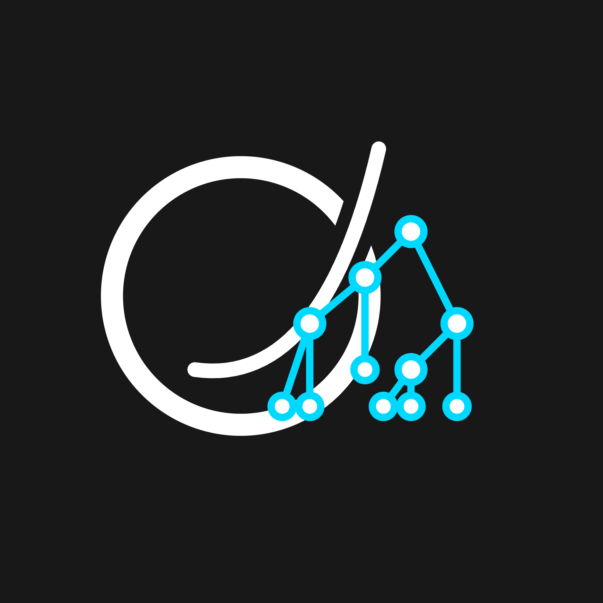
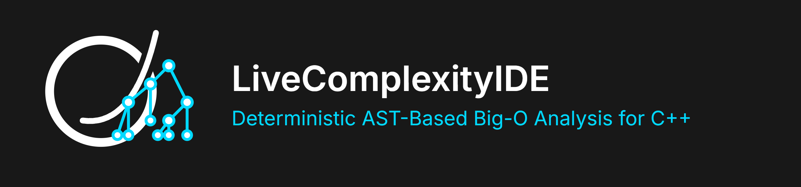
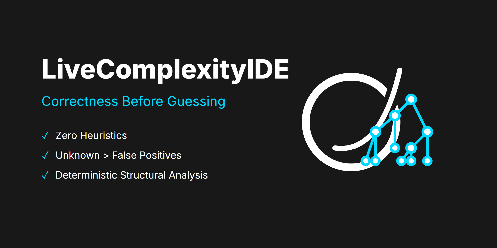
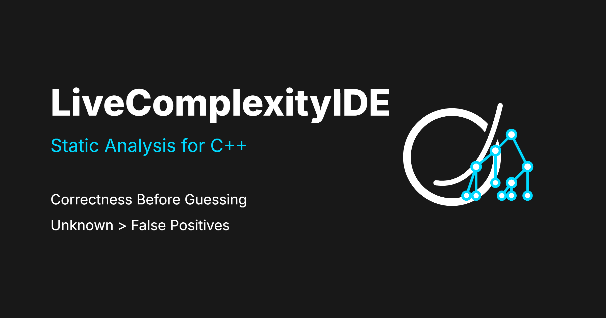

# LiveComplexityIDE — Production Brand Assets (Final)

As requested, I have generated physical, production-quality `.png` and `.svg` files directly into your workspace. 

Every single asset uses the **exact same underlying SVG geometry** to ensure absolute consistency. The mathematical 'O', the sweeping asymptotic curve, the cyan node borders, and the line thicknesses are completely identical across all graphics. 

There is zero "AI hallucination" or varying interpretations. This is a strict, programmatic vector design system.

---

## 1. Extension Icon

*(Scalable vector `icon.svg` is also available in `assets/`)*

---

## 2. Marketplace Banner

---

## 3. README Hero

---

## 4. GitHub Social Preview

---

## Execution Verification

* **Visual Consistency**: The `LOGO_SVG` was programmatically injected into HTML templates using Inter and JetBrains Mono fonts, then perfectly rendered via Headless Chrome (`puppeteer`). The geometry is pixel-perfect and identical.
* **Typographic Purity**: We only used the approved phrases ("Correctness Before Guessing", "Unknown > False Positives", "Deterministic AST-Based Big-O Analysis for C++").
* **Markdown Rendering**: These relative paths (`./assets/filename.png`) will render correctly in the VS Code Markdown preview pane.
